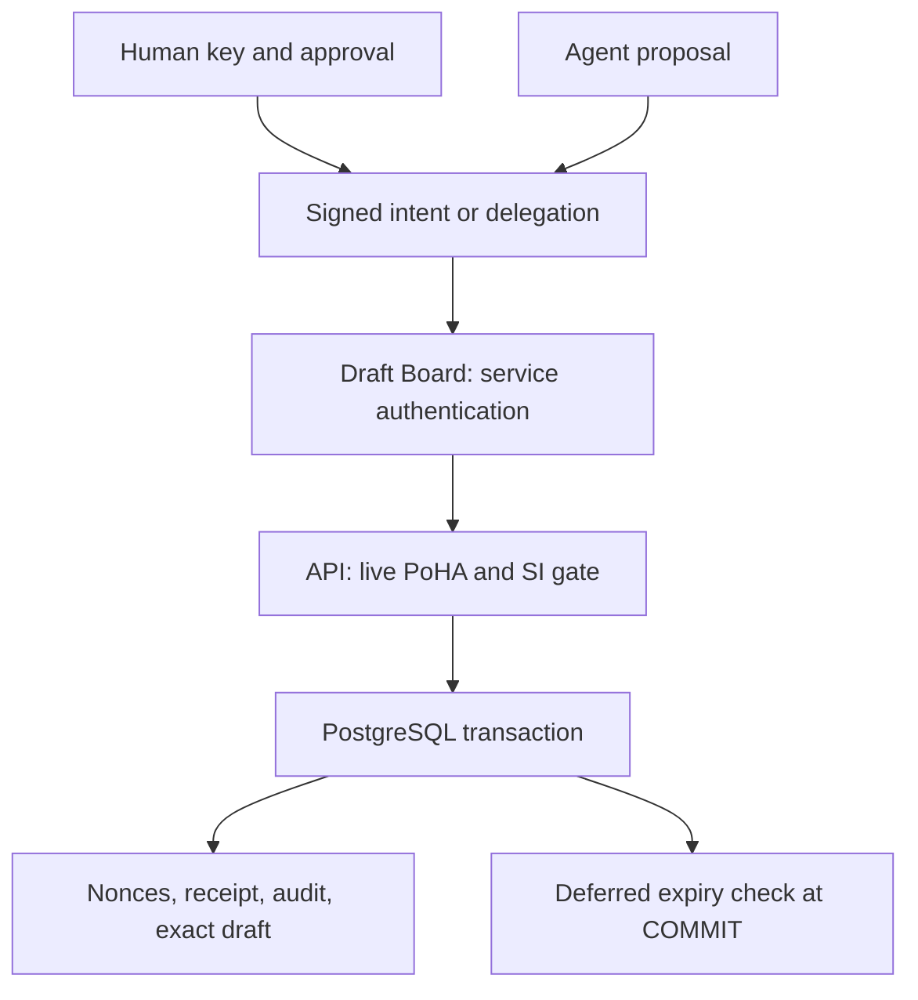

# Architecture and mediation inventory

## Production signed draft path

`examples/draft-board/server.mjs` relays exact signed bytes to `/api/v1/actions/commit-draft`. `web-server.mjs` requires enabled feature flags, durable account storage and service authentication. `lib/poha-v1.mjs` inspects the human/agent authority chain. `lib/sovereignty-inference.mjs` binds the verified result to expected intent; its decision remains inspection-only. `lib/poha-postgres.mjs` consumes replay ledgers and writes `hs_effects` in one transaction. `migrations/001-poha.sql` supplies the deferred COMMIT-time expiry trigger. Draft Board performs no separate business write for new drafts.

Account mutations are serialized through `lib/account-state-postgres.mjs`; authority mutations and commit use a principal advisory lock. This claim assumes the API and database adapters are the only writers to protected state. SQL administrators, filesystem operators and code deployers remain trusted. Backup import is a privileged archival path, explicitly allowed to restore historical expired effects; it is not a fresh authority admission.

## Other enforcement paths

| Surface | Mechanism | Claim boundary |
| --- | --- | --- |
| Signed `/api/v1/actions/commit-draft` | Live signed PoHA, service policy, SI, PostgreSQL atomic write | Production local draft only; 1–6000 exact payload bytes; no disclosure service |
| `/api/v1/actions/authorize` | Signed proof + durable nonce/receipt | Authorization admission; no atomic remote business effect |
| `/api/hsc/apps/register`, mining start/claim, legacy agency grant/revoke | `guardDirectHumanMutation` / `guardHscMutation` | Session-derived server envelope; not a signed human intent proof |
| `/api/v1/agency/*`, identity revoke | Signed PoHA records and durable principal mutation | Human-owned authority administration, separate from draft effect gate |
| Account, identity providers, trust, contributions/review, utility, community events, wallet activation, mainnet review, anchor/devnet, token creation | Their own authentication/policy/control paths | Outside the six-property SI proof scope; no global complete-mediation conclusion |
| Independent verifier / external trust service | Pinned issuer status, transactionally consumed challenge/nonce/epoch, service outbox | Research admission into service-owned PostgreSQL; no distributed consensus |
| Agent control gateway | Two fixed tools, shared budgets, policy-version invalidation, locked worker | Research local dataset read / local draft only |
| Sovereign quorum and continuity | Pinned Ed25519 votes over exact root/policy/intent; fenced restoration | Certificate validation and abstract ledger recovery; not a replicated production network |

The table is a review inventory, not an automated proof that no route exists. Audit new routes and adapters when `web-server.mjs` or business storage changes. An action in `PROTECTED_ACTIONS` is not automatically mediated merely because it is registered.

## External and distributed trust

The independent verifier imports only Node built-ins, not core COHIBA code. It still trusts configured issuer keys and issuer claims about PHONE_VERIFIED identity and revocation. This is not a trustless human or zero-knowledge credential. Its signed status TTL is at most 30 seconds; challenge and intent bindings constrain replay but cannot communicate later revocation through a partition.

The quorum experiment checks `n=3f+1`, threshold `2f+1`, distinct pinned keys and identical statements, TTL at most 60 seconds. No replicated log, view-change protocol, durable distributed nonce ledger or anti-equivocation store is implemented. A certificate alone does not guarantee independent operators, honest quorum assumptions, global ordering or consistent latest state.
