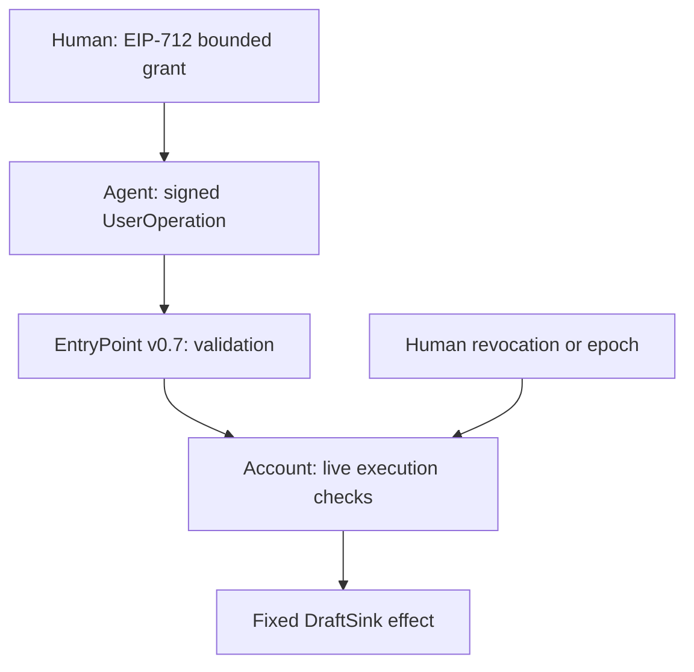

# Human Signal ERC-4337 reference adapter

**Experimental, pre-audit, local EVM evidence.** This is an open-source fixed-effect account for the upstream **EntryPoint v0.7.0** profile. It is not a production wallet, ERC-7579 module, universal validator, public bundler integration or live Ethereum deployment.

## Demonstrated chain

Human EOA signs a domain-separated EIP-712 delegation → agent signs the full EntryPoint UserOperation hash → account checks fixed target/selector/resource and budgets → account rechecks current revocation/epoch/expiry/call budget immediately before effect → official EntryPoint executes the account and synthetic DraftSink on an Ethereum EVM.



`contracts/HumanSignalAccount.sol` implements upstream `IAccount` and `IAccountExecute`; `adapter.mjs` constructs typed grant data, packed operations and domain-bound signing hashes. `test/runtime.mjs` compiles source and executes signed Ethereum transactions on EthereumJS VM. It deploys the **actual packaged upstream EntryPoint bytecode**, not an EntryPoint mock. The package lock pins dependency bytes; evidence hashes the upstream creation bytecode separately.

## Authority and containment

The owner is an EOA signing key. Calling it “human” describes the configured authority role; the account does not prove personhood or PHONE_VERIFIED identity. This Ethereum profile uses secp256k1/EIP-712, unlike the existing PoHA Ed25519 JSON profile. There is **no automatic signature conversion, issuer bridge or synchronized off-chain revocation**. A future bridge must authenticate the Ethereum owner binding and specify issuer/epoch/revocation trust explicitly.

A grant binds agent, immutable target, allowed `commit(bytes32,bytes)` selector, exact resource, max successful calls, cumulative conservative gas budget, valid-after/until, authority epoch, salt and trusted EntryPoint. EIP-712 also binds chain ID and account address. The agent signs the entire v0.7 UserOperation hash, including nonce, call bytes, fee/gas fields, chain ID and EntryPoint. It cannot alter the owner grant or mint a new one.

The only delegated effect is one zero-value CALL to the constructor-fixed DraftSink; no arbitrary target, delegatecall, batch execution, token approval/transfer or ownership change is available. The target code hash is pinned and rechecked at execution. The actual call bytes are canonical and signed; resource and payload bounds are rederived, not accepted from an off-chain ALLOW. Agent-selected text within the grant's resource is allowed; the human grant is not per-action content approval.

## Validation is not execution authority

`validateUserOp` verifies authority/signatures and reserves the operation's maximum gas cost from the grant's cumulative budget. It returns ERC-4337 time-window data instead of reading TIMESTAMP during validation. `executeUserOp` requires the trusted EntryPoint and exact admitted operation hash, then verifies signatures, scope, **current** revoke/epoch/call state, strict execution-time expiry and pinned target code before the call. A reentrancy fence protects execution.

All operations in a bundle may validate before any executes. Consequently two operations can both pass an initial maxCalls check: the second must still fail at execution if the first exhausts the grant. Similarly, an earlier human-signed revocation operation in that same official bundle invalidates a later agent operation that already passed validation. Tests exercise both cases against upstream EntryPoint.

Owner administration supports direct owner revoke/epoch advancement and a typed, permissionlessly relayed revocation signed by the owner. The administrative UserOperation also requires the owner's operation signature. Agents receive no administrative channel.

## Ethereum atomicity boundary

A target revert rolls back the business effect and successful-call counter. **EntryPoint nonce consumption, gas charges and the conservative gas reservation persist for an execution-failed UserOperation.** A replay cannot create another effect. This is not the SQL-style claim that every authorization ledger entry rolls back with every failed effect.

The gas reservation is the signed maximum prefund cost, not actual gas spent; unused reservation is not released. Failed execution also retains the admitted-hash record, which is unreachable through a new canonical EntryPoint operation because its nonce was consumed. Do not use this storage/gas policy as an optimized production wallet policy.

“Commit-time” here means revalidation immediately before a contained EVM call in the same transaction. It does not mean Ethereum finality, cross-chain atomicity, off-chain delivery or recovery from a reorg. The EVM test sets chain ID 1 for domain checks but has no RPC connection to Ethereum mainnet.

## Reproduce

Use Node 24 and a clean checkout:

```sh
npm ci --prefix examples/erc4337 --ignore-scripts
npm run verify:erc4337
npm audit --prefix examples/erc4337 --audit-level=high
```

The test uses public synthetic private keys and synthetic draft bytes on an in-memory VM. It never reads a production wallet, broadcasts a transaction, accesses a bundler or spends live ETH. Output: `examples/erc4337/evidence/interop.json` (ignored, uploaded by dedicated CI).

The evidence includes source/lock hashes, compiler/runtime profile, upstream creation-bytecode hash, actual gas measurements and successful/failed UserOperation events. Gas is local execution evidence, not a public-network fee estimate or throughput benchmark. CI binds artifacts to the source run. Scope flags explicitly remain `publicNetwork:false`, `bundlerRpcVerified:false`, and `independentIntegration:false`.

## Attack coverage

| Scenario | Expected observation |
| --- | --- |
| Valid owner grant and agent intent | One exact draft effect; protocol nonce replay denied |
| Forged/missing human signature or wrong agent | No effect, no gas reservation from rejected bundle |
| Widen target/selector/resource/calls/gas/expiry; alter signed bytes | Denied |
| Unsupported entry route, initCode or paymaster profile | Denied |
| Two operations exceed maxCalls in one bundle | First effect succeeds, later effect fails; nonce/gas still charged |
| Owner-signed revocation precedes agent execution in same bundle | Revoke succeeds; previously validated agent effect fails |
| Cached validation followed by expiry / epoch advancement | Cannot override live execution authority |
| Target intentionally reverts | Effect/call spend roll back; EntryPoint nonce/gas reservation remain |
| Different chain/account/EntryPoint domain or direct agent bypass | Denied |
| New nonce after cumulative gas budget spent | Cannot reset grant budget |

Read [SECURITY.md](SECURITY.md) for assumptions, gas semantics and exclusions.

## Before a public interoperability claim

Independent review must cover signatures/canonicalization, gas economics, pending admission state, reentrancy, bundler validation traces and actual target behavior. Run ERC-7562-compatible bundler simulation/RPC checks; no such compliance is inferred merely from successful on-chain `handleOps`. Verify the chosen EntryPoint/version/address on the chosen network. Test on a public testnet with transaction hashes and an independently operated integrator. Demonstrate reorg/receipt reconciliation and truthful success reporting from UserOperation events, not just outer transaction status. Audit factory/paymaster/ERC-1271/upgrade/recovery support separately if added; all are excluded here.

Primary specifications: [ERC-4337](https://eips.ethereum.org/EIPS/eip-4337), [ERC-7562](https://ercs.ethereum.org/ERCS/erc-7562), [upstream v0.7.0 source](https://github.com/eth-infinitism/account-abstraction/tree/v0.7.0). New reference code is GPL-3.0-only; dependencies retain their own notices and licenses.
